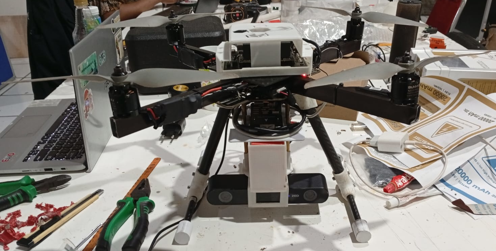
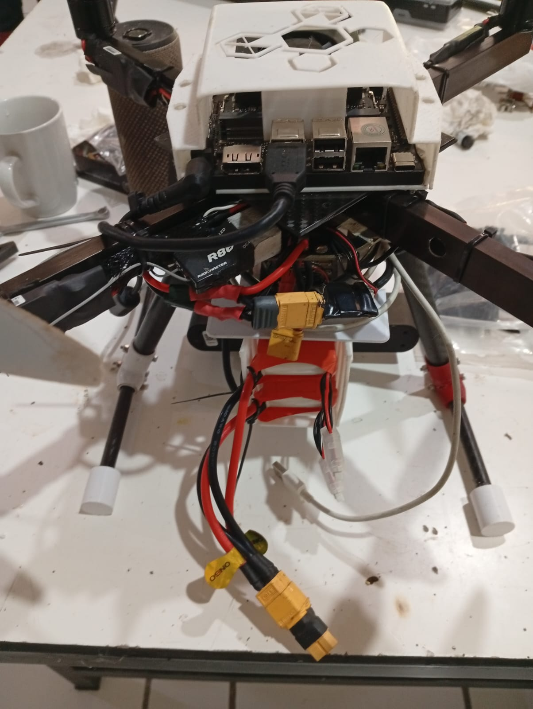

---

## Drone System Wiring

### Drone Picture

##### from front

##### from back

### Drone Wiring Diagram

---

### 1. Companion Computer Communication

| Device | Device Port | Connected To | Pixhawk / Jetson Port | Description |
|---|---|---|---|---|
| Jetson Orin Nano | USB | Pixhawk 6C | USB Type-C | MAVLink communication (companion computer) |
| ZED2i Camera | USB | Jetson Orin Nano | USB 3.0 Jetson | Stereo camera for vision processing |

---

### 2. Telemetry & Sensor

| Device | Device Port | Connected To | Pixhawk Port | Description |
|---|---|---|---|---|
| CUAV PW-Link | UART | Pixhawk 6C | TELEM1 | Telemetry communication to ground station |
| Optical Flow MTF-01P | UART | Pixhawk 6C | TELEM2 | Optical flow sensor for movement estimation |

---

### 3. RC Receiver

| Device | Receiver Port | Connected To | Pixhawk Port | Description |
|---|---|---|---|---|
| RC Receiver | SBUS Out | Pixhawk 6C | SBUS | Pilot control input |

---

### 4. Motor & ESC (Standard X Configuration)

| Motor | ESC Signal | Pixhawk Port | Description |
|---|---|---|---|
| Motor 1 | PWM Signal | MAIN OUT 1 | Front Right |
| Motor 2 | PWM Signal | MAIN OUT 2 | Rear Left |
| Motor 3 | PWM Signal | MAIN OUT 3 | Front Left |
| Motor 4 | PWM Signal | MAIN OUT 4 | Rear Right |

---

### 5. System Architecture Summary

| Component | Function |
|---|---|
| Pixhawk 6C | Main flight controller |
| Jetson Orin Nano | Companion computer for AI / vision |
| ZED2i | Stereo camera for visual perception |
| MTF-01P | Optical flow sensor for velocity estimation |
| PW-Link | Telemetry to Ground Control Station |
| Receiver SBUS | Manual control from pilot |
| ESC + Brushless | Drone motor actuator |

---
